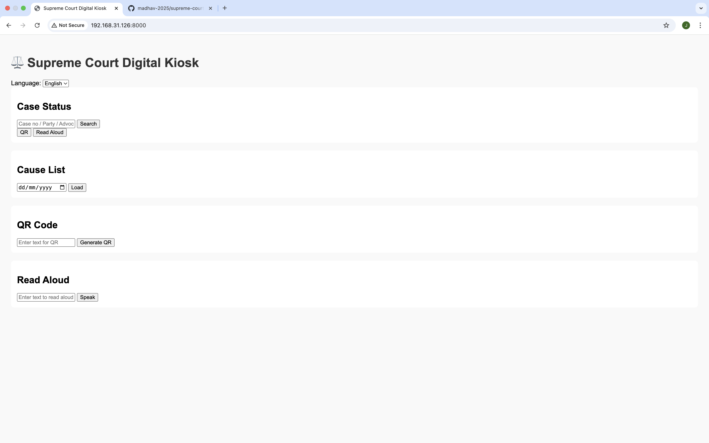

## Demo Screenshots

### Case Status


### Cause List


### QR Demo


### Read Aloud


# Supreme Court Digital Kiosk

Interactive kiosk app for Supreme Court case info and cause list.

## Features
- Case Status Search
- Cause List by Date
- QR Code Generation
- Read Aloud (Text-to-Speech)
- Hindi/English Toggle
- LAN Accessible

## Tech Stack
- Backend: Flask (Python)
- Frontend: HTML/CSS/JS
- Demo Data: JSON

## Run Locally
```bash
python3 -m venv .venv
source .venv/bin/activate
pip install -r requirements.txt
python app.py
